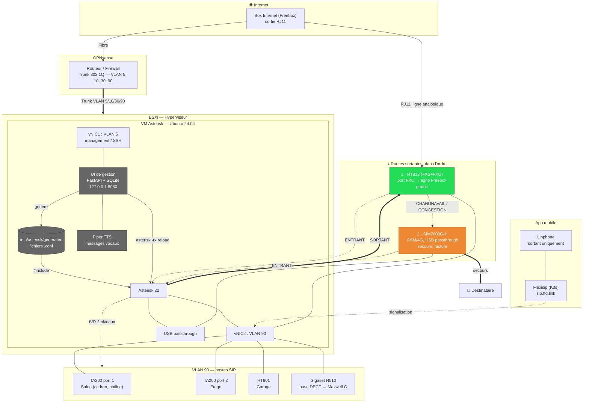

# Architecture

## Vue d'ensemble



## Lecture du schéma

Quatre blocs empilés : le physique (box, ligne analogique), le réseau (OPNsense et son
trunk 802.1Q), la virtualisation (la VM et tout ce qui y tourne), puis les périphériques.

Le point important est **en gris, dans la VM** : l'interface de gestion, la base et Piper
sont colocalisés avec Asterisk et ne communiquent que par la boucle locale et par le
système de fichiers. L'interface écrit dans `/etc/asterisk/generated/`, puis demande à
Asterisk de relire ses fichiers. Aucun port supplémentaire n'est ouvert sur le réseau, et
— surtout — **aucun appel ne traverse l'interface**.

Un seul composant s'écarte de ce schéma : `telephonie-events`, qui lit le flux d'événements
d'Asterisk par l'AMI (`127.0.0.1:5038`, compte en lecture seule) pour le republier vers
Home Assistant. Il observe et ne décide de rien : arrêté, les appels se déroulent
exactement pareil.

## Chaîne de traitement d'un appel

### Appel sortant depuis un poste

```
Décroché ──▶ [from-internal] ──▶ motif _0[1-9]XXXXXXXX
                                       │
                                       ▼
                          GoSub(sub-dial-number, numéro, durée)
                                       │
                          ┌────────────┴────────────┐
                          ▼                         │
        Dial(PJSIP/…@grandstream-fxo)               │
                          │                         │
     ┌────────────────────┼─────────────────┐       │
     │ ANSWER             │ CHANUNAVAIL     │ NOANSWER / BUSY
     ▼                    ▼                 ▼
  conversation    Dial(Quectel/quectel0/…)  Return() — pas de bascule
                          │
                   ┌──────┴──────┐
                   ▼             ▼
             conversation   Playback(all-circuits-busy-now)
```

Le détail qui fait tout fonctionner : quand Internet tombe, le HT813 perd son
enregistrement SIP et `Dial()` échoue en une à deux secondes avec `CHANUNAVAIL`, sans
consommer le délai de sonnerie. À l'inverse, un correspondant qui ne décroche pas renvoie
`NOANSWER` — qui ne déclenche **pas** la bascule GSM, puisqu'il n'y a aucune raison de
rappeler la même personne par un chemin payant.

### Appel entrant

```
Ligne Freebox ──▶ HT813 (FXO) ──▶ [from-external-incoming]
                                          │
                                    Answer + menu vocal
                                          │
                    ┌─────────────────────┴───────────────┐
                    ▼ touche 1                            ▼ touche 2
        groupe « toute la maison »                  [menu-personne]
                    │                                     │
         tous les postes sonnent                 une touche par personne
                    │                                     │
          sans réponse : boîte 199          sans réponse : boîte de la personne
```

## Matériel

| Rôle | Matériel | Raccordement | Remarque |
|---|---|---|---|
| Serveur PBX | VM Ubuntu 24.04 LTS sur ESXi | — | Asterisk 22, chan-quectel, UI de gestion |
| Salon + Étage | Yeastar TA200 (2 ports FXS) | Réseau, VLAN 90 | Le port 1 accueille le téléphone à cadran |
| Garage | Grandstream HT801 (1 port FXS) | Réseau jusqu'au bâtiment | Jamais de cuivre analogique entre bâtiments : risque foudre |
| Pont Freebox | Grandstream HT813 (FXS+FXO) | Réseau + prise tél. Freebox | Le port FXO se comporte comme un téléphone branché sur la ligne |
| Secours GSM | Waveshare SIM7600G-H + SIM | USB passthrough | `chan-quectel`, voix par UAC |
| DECT | Gigaset Maxwell C + base N510 | Réseau, VLAN 90 | Jusqu'à trois combinés sur la base |
| Mobile | Linphone via Flexisip | Internet | Sortant seulement — le push VoIP iOS demande un compte Apple Developer |

## Plan de numérotation

```
15 17 18 112 114 115 119 196 197   Urgences — toujours joignables, jamais filtrées
                                    et interdites comme numéro interne

100  Salon                         Postes : un numéro par appareil
101  Étage
102  Garage
103  DECT
104  Mobile

199  Toute la maison               Groupes : font sonner plusieurs postes
2xx  Personnes                     Font sonner tous les postes d'une personne

*97  Ma messagerie                 Codes de service (voir extensions.conf)
*98  Une autre messagerie
*43  Test d'écho
*60  Annonce de l'heure
*65  Annonce du numéro du poste
*9   Menu de décroché des postes « hotline »
```

Les numéros à trois chiffres commençant par 1 sont **réservés** : `112`, `114`, `115` et
`119` sont des numéros d'urgence, et un poste interne qui porterait l'un d'eux les rendrait
inaccessibles. L'interface refuse leur saisie, et le contrôle avant application le
rappelle. C'est la raison pour laquelle les personnes sont numérotées en `2xx`.

## Ce qui reste hors périmètre de ce dépôt

- **Flexisip** (passerelle SIP publique pour l'application mobile) reste déployé sur K3s.
  Ce dépôt décrit l'endpoint `mobile` côté Asterisk, pas les manifestes Flexisip.
- **Le push VoIP iOS** n'est pas implémenté : il demande un compte Apple Developer Program
  et un fork compilé de Linphone. L'application ne reçoit donc pas d'appel quand elle est
  fermée — usage sortant uniquement.
- **Le passthrough USB ESXi** est décrit dans [02 — Installation](02-installation.md) mais
  se configure côté hyperviseur, pas depuis la VM.
